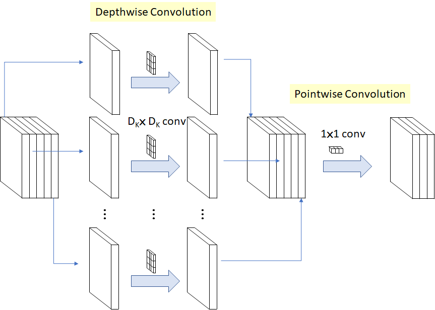
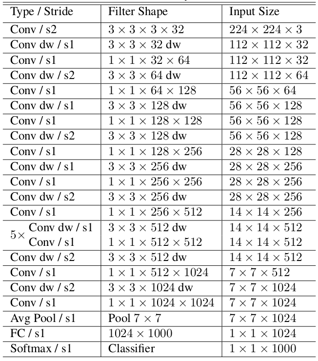

# MobileNet 
Implementation of [MobileNets: Efficient Convolutional Neural Networks for Mobile Vision Applications](https://arxiv.org/abs/1704.04861). Give us a star if you like this repo.

Run it on colab:

<a href="https://colab.research.google.com/drive/1j3eh-GVhLIIHZ6HsT1jg56K9U1P_BiTh?usp=sharing"> </a>


Library Logo <--- TODO:

<p align="center">
    
</p>

Description about your project. Why do you choose to build this?  <--- TODO:

Slide about your project (if it's available) <--- TODO:

In this paper, the author used `Depthwise Separable Convolution` to reduce the model size and complexity. It is particularly useful for mobile and embedded vision applications

`Depthwise separable convolution` is a `depthwise convolution` followed by a `pointwise convolution` as follows:
<p align="center">
    
</p>

You can read more on [page 2](https://arxiv.org/pdf/1704.04861.pdf)

MobileNet Architecture :


<p align="center">
    
</p>

To implement this paper, we use tensorflow libary with:
- Depthwise_Layer: [DepthwiseConv2D](https://www.tensorflow.org/api_docs/python/tf/keras/layers/DepthwiseConv2D) >> [BatchNormalization](https://keras.io/api/layers/normalization_layers/batch_normalization/) >> [Relu](https://keras.io/api/layers/activations/#relu-function)
- Pointwise_Layer: [Conv2D with 1x1 filter](https://www.tensorflow.org/api_docs/python/tf/keras/layers/Conv2D) >> [BatchNormalization](https://keras.io/api/layers/normalization_layers/batch_normalization/) >> [Relu](https://keras.io/api/layers/activations/#relu-function)


Authors:
- Github: https://github.com/quynhtl 
- Email: tranlequynh.uet@gmail.com 
- Github: https://github.com/NKNK-vn 
- Email: khoi.nkn12@gmail.com
- Github: https://github.com/hthuy1998
- Email: thuybg98a5@gmail.com
- Github: https://github.com/TrungBui-Purdue-5913
- Email: buitranchitrung2002@gmail.com

Advisors:
- Github: https://github.com/bangoc123
- Email: bangoc.gdg@gmail.com

## I.  Set up environment
- Step 1: Make sure you have installed Miniconda. If not yet, see the setup document <a href="https://docs.conda.io/en/latest/miniconda.html">here</a>


- Step 2: `cd` into `MobileNet` and use command line
```
conda env create -f environment.yml
```

- Step 3: Run conda environment using the command

```
conda activate mobile_net
``` 

## II.  Set up your dataset

<!-- - Guide user how to download your data and set the data pipeline  -->
1. Download the data:
- Download dataset [here](https://storage.googleapis.com/mledu-datasets/cats_and_dogs_filtered.zip)
2. Extract file and put folder ```train``` and ```validation``` to ```./data``` 
- train folder was used for the training process
- validation folder was used for validating training result after each epoch

This library use ImageDataGenerator API from Tensorflow 2.0 to load images. Make sure you have some understanding of how it works via [its document](https://keras.io/api/preprocessing/image/)
Structure of these folders in ```./data```

```
train/
...cats/
......cat.0.jpg
......cat.1.jpg
...dogs/
......dog.0.jpg
......dog.1.jpg
```

```
validation/
...cats/
......cat.2000.jpg
......cat.2001.jpg
...dogs/
......dog.2000.jpg
......dog.2001.jpg
```

<!-- - References: [NLP](https://github.com/bangoc123/transformer) and [CV](https://github.com/bangoc123/mlp-mixer) -->


## III. Train your model by running this command line

Training script:


```python

python train.py --epochs ${epochs} --num-classes ${num_classes} 

```
You want to train a model in 10 epochs for binary classification problems (with 2 classes)


Example:

```python

python train.py --epochs 10 --num-classes 2 

``` 

There are some important arguments for the script you should consider when running it:

- `train-folder`: The folder of training data
- `valid-folder`: The folder of validation data
- `model-folder`: Where the model after training saved
- `num-classes`: The number of your problem classes.
- `batch-size`: The batch size of the dataset
- `image-size`: The image size of the dataset
- `alpha`: Width Multiplier. It was mentioned in the paper on [page 4](https://arxiv.org/pdf/1704.04861.pdf)
- `rho`: Resolution Multiplier, It was mentioned in the paper on [page 4](https://arxiv.org/pdf/1704.04861.pdf)
## IV. Predict Process

```bash
python predict.py --test-file-path ${link_to_test_data}
```

## V. Result and Comparision


My implementation
```
Epoch 66/70
125/125 [==============================] - 39s 309ms/step - loss: 0.1861 - acc: 0.9280 - val_loss: 0.3813 - val_acc: 0.8500
Epoch 67/10
125/125 [==============================] - 39s 309ms/step - loss: 0.1812 - acc: 0.9305 - val_loss: 0.3837 - val_acc: 0.8590
Epoch 68/10
125/125 [==============================] - 39s 309ms/step - loss: 0.1721 - acc: 0.9320 - val_loss: 0.3816 - val_acc: 0.8600
Epoch 69/10
125/125 [==============================] - 39s 309ms/step - loss: 0.1841 - acc: 0.9285 - val_loss: 0.3826 - val_acc: 0.8610

```

<!-- **FIXME**

Other architecture

```
Epoch 6/10
391/391 [==============================] - 115s 292ms/step - loss: 0.1999 - acc: 0.9277 - val_loss: 0.4719 - val_acc: 0.8130
Epoch 7/10
391/391 [==============================] - 114s 291ms/step - loss: 0.1526 - acc: 0.9494 - val_loss: 0.5224 - val_acc: 0.8318
Epoch 8/10
391/391 [==============================] - 115s 293ms/step - loss: 0.1441 - acc: 0.9513 - val_loss: 0.5811 - val_acc: 0.7875
``` -->

TODO:
Your comments about these results 


<!-- ## VI. Running Test

When you want to modify the model, you need to run the test to make sure your change does not affect the whole system.

In the `./folder-name` **(FIXME)** folder please run:

```bash
pytest
``` -->
## VI. Feedback
If you meet any issues when using this library, please let us know via the issues submission tab.


